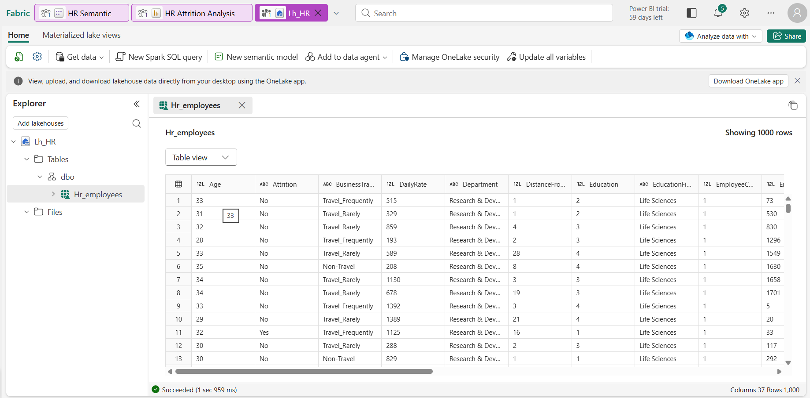

# HR Attrition Analytics Dashboard

Diagnosing why employees leave and where to act first, using Microsoft Fabric (Dataflow Gen2, Lakehouse) and Power BI.

## Table of Contents

- [Overview](#overview)
- [Business Problem](#business-problem)
- [Dataset Description](#dataset-description)
- [Tools & Technologies](#tools--technologies)
- [Project Structure](#project-structure)
- [Data Cleaning & Preparation](#data-cleaning--preparation)
- [EDA & Key Insights](#eda--key-insights)
- [Dashboard](#dashboard)
- [How to Run This Project](#how-to-run-this-project)
- [Final Recommendations / Future Work](#final-recommendations--future-work)
- [Author & Contact](#author--contact)

## Overview

End-to-end HR analytics project. Raw employee data is ingested into a Microsoft Fabric Lakehouse, modeled in a Power BI semantic model, and published as a two-page interactive dashboard (Overview and Deep Dive). Individual salary data is protected with column-level security, so HR can explore attrition patterns freely without exposing pay.

**Scope:** 1,470 employees, 237 leavers, breakdowns by department, job role, age, gender, education, marital status, business travel, overtime and salary band.

**Live report:** [Open in Microsoft Fabric](https://app.fabric.microsoft.com/links/beNxlPJ9tw?ctid=e93d71d6-b5c0-4b78-a861-d9964ecdfcd6&pbi_source=linkShare) (requires workspace access)

## Business Problem

Overall attrition is **16.1%**, above the 10 to 15% industry range. HR Leadership had no central view of where and why people were leaving. Data sat in disconnected records, and analysis was manual, slow and inconsistent between reporting cycles.

Unplanned attrition has real cost: recruiting, onboarding, lost productivity during ramp-up and lost knowledge. Without segment-level visibility, retention budget gets spent reactively instead of on the highest-risk groups.

Questions this project answers:

1. What is the overall attrition rate, and how does it compare to the benchmark?
2. Which departments and job roles lose the most people?
3. How do pay and age relate to leaving?
4. Which working conditions (overtime, travel, marital status) correlate most with leaving?

Full requirements are in the [BRD](Docs/BRD.pdf).

## Dataset Description

| Item | Detail |
|---|---|
| File | `Data/HR-Employee-Attrition.csv` |
| Records | 1,470 employees (one row per employee) |
| Source columns | 35 (age, attrition, department, job role, monthly income, overtime, travel, marital status, education field, years at company and more) |
| Engineered columns | Age Group, Salary Band (37 columns in the Lakehouse table) |
| Target field | `Attrition` (Yes / No) |
| Origin | Public IBM HR Analytics Employee Attrition dataset (fictional data created by IBM data scientists) |

## Tools & Technologies

- **Microsoft Fabric:** Dataflow Gen2, Lakehouse, OneLake Security
- **Power BI:** semantic model, DAX measures, interactive report
- **DAX:** KPI measures (attrition rate, employees left, headcount, average income, average tenure of leavers)
- **Git / GitHub:** version control and documentation

## Project Structure

```
HR-Attrition-Analytics-Dashboard/
├── Dashboard/
│   ├── HR Attrition Analysis.pbit
│   ├── HR Attrition Analysis.pbix
│   ├── HR Attrition Analysis.pdf
│   └── README.md
├── Data/
│   ├── HR-Employee-Attrition.csv
│   └── README.md
├── Docs/
│   ├── BRD.pdf
│   ├── HR_Attrition_Presentation.pdf
│   └── README.md
├── Screenshots/
│   ├── Deep Dive.png
│   ├── Fabric.png
│   ├── Lakehouse.png
│   ├── Overview.png
│   ├── Schematic model.png
│   └── README.md
├── LICENSE
└── README.md
```

## Data Cleaning & Preparation

1. **Ingest:** Dataflow Gen2 loaded the raw CSV through the Web/CSV connector.
2. **Enrich:** created `Age Group` (18 to 25, 26 to 35, 36 to 45, 45 to 60) and `Salary Band` (Under 3k, 3k to 6k, 6k to 10k, Above 10k) for readable grouped visuals.
3. **Store:** loaded to Lakehouse `Lh_HR` as flat table `Hr_employees`. A flat table fits a dataset under 2,000 rows, so a star schema adds complexity with no benefit.
4. **Model:** built a semantic model on top of the Lakehouse table with 5 core DAX measures.
5. **Secure:** applied column-level security on `MonthlyIncome` so general viewers cannot see individual salary, while salary-band analysis still works in aggregate.

## EDA & Key Insights

| Segment | Attrition rate | Comparison |
|---|---|---|
| Sales Representatives | 39.8% | 33 of 83 left, company average 16.1% |
| Age 18 to 25 | 35.8% | Age 36 to 45 is only 9.2% |
| Overtime workers | 30.5% | Non-overtime 10.4%, about 3x gap |
| Frequent travelers | 24.9% | Non-travelers 8.0%, about 3x gap |
| Single employees | 25.5% | Married 12.5%, divorced 10.1% |
| Sales department | 20.6% | HR 19.0%, R&D 13.8% |
| Human Resources education field | 25.9% | Life Sciences 14.7%, Medical 13.6% |

Other findings:

- Overall: 237 of 1,470 employees left (16.1%). Average income is 6,503 per month. Leavers had an average tenure of 5.1 years.
- Laboratory Technicians (23.9%) and Human Resources roles (23.1%) are also above the company average.
- Men leave slightly more than women overall (17.0% vs 14.8%).
- Lower salary bands skew toward departures, and the Salary Band split by gender is visible on the Overview page.

Note: these results show correlation, not causation. Use them to guide HR judgment, not replace it.

## Dashboard

Two cross-filterable pages with slicers for Department, Gender and Salary Band.

**Overview:** KPI cards (attrition rate, employees left, headcount, average income, average tenure of leavers), department bar chart, decomposition tree (Department, Job Role, Salary Band), job role table and salary band split by gender.


**Deep Dive:** attrition by age group, gender, education field, marital status, business travel and overtime.


**Platform views:**




A PDF export is available at [`Dashboard/HR Attrition Analysis.pdf`](Dashboard/HR%20Attrition%20Analysis.pdf).

## How to Run This Project

**Option A: open the report locally**

1. Clone the repository:
   ```bash
   git clone https://github.com/seema-kri/HR-Attrition-Analytics-Dashboard.git
   cd HR-Attrition-Analytics-Dashboard
   ```
2. Install [Power BI Desktop](https://powerbi.microsoft.com/desktop/).
3. Open `Dashboard/HR Attrition Analysis.pbix`.
4. If prompted, update the data source to point to `Data/HR-Employee-Attrition.csv`, then click **Refresh**.

**Option B: rebuild in Microsoft Fabric**

1. Create a Fabric workspace and a Lakehouse (for example `Lh_HR`).
2. Create a Dataflow Gen2, load `Data/HR-Employee-Attrition.csv`, add the `Age Group` and `Salary Band` columns, and send the output to the Lakehouse table `Hr_employees`.
3. Create a semantic model from the Lakehouse table and add the DAX measures.
4. Use `Dashboard/HR Attrition Analysis.pbit` as a template, point it at your semantic model, and publish.
5. Restrict `MonthlyIncome` for general viewers with OneLake Security (column-level security).

A free Fabric trial is enough to follow these steps.

## Final Recommendations / Future Work

**Recommendations (ranked by evidence strength)**

1. Fix pay and career path for Sales Representatives and review quota load. This is the highest-risk role at 39.8%.
2. Review overtime policy and rebalance workload (30.5% vs 10.4%).
3. Build structured onboarding and mentoring for employees aged 18 to 25 (35.8%).
4. Cap travel or offer hybrid travel schedules for frequent travelers (24.9% vs 8.0%).

**Illustrative impact:** cutting attrition to 25% for Sales Representatives and ages 18 to 25 would retain about 26 employees and bring company attrition from 16.1% to about 14.4%, back inside the industry range. The cost figure assumes replacement cost of 50% of annual pay and should be replaced with actual HR data.

**Future work**

- Add an exit-date field for true time-series trend analysis (current data is a point-in-time snapshot).
- Build ML-based attrition risk scoring for active employees.
- Add Fabric Data Activator alerts when attrition crosses a threshold.
- Pilot the Sales recommendations and measure the result.

## Author & Contact

**Seema Kumari**
Data Analyst | Business Intelligence & Microsoft Fabric

- 📧 Email: [seemakri136@gmail.com](mailto:seemakri136@gmail.com)
- 💼 LinkedIn: [linkedin.com/in/seema-kumari-375763308](https://linkedin.com/in/seema-kumari-375763308)

---

⭐ If you found this project useful, consider giving it a star. It helps others discover it.
