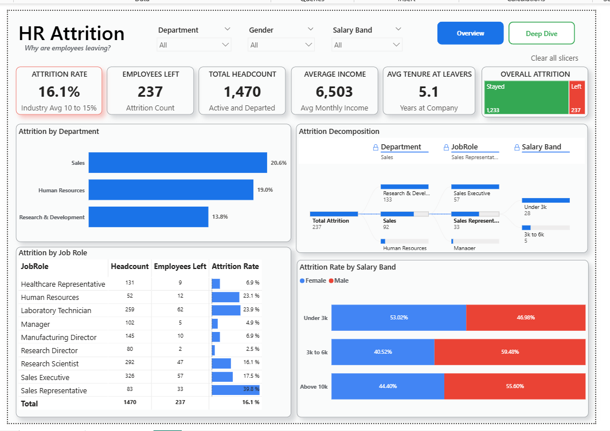

# HR Attrition Analytics Dashboard

**Diagnosing why employees leave and where retention effort should go using Microsoft Fabric and Power BI.**

Analyzing employee attrition across departments, compensation bands, and behavioral factors to support HR retention strategy, built with **Microsoft Fabric (Dataflow Gen2, Lakehouse)** and **Power BI**.


🔗 **[View Live Dashboard](https://app.fabric.microsoft.com/links/beNxlPJ9tw?ctid=e93d71d6-b5c0-4b78-a861-d9964ecdfcd6&pbi_source=linkShare)**

---

## Table of Contents
- [Overview](#overview)
- [Live Dashboard](#live-dashboard)
- [Business Problem](#business-problem)
- [Dataset Description](#dataset-description)
- [Tools & Technologies](#tools--technologies)
- [Project Structure](#project-structure)
- [Data Cleaning & Preparation](#data-cleaning--preparation)
- [EDA & Key Insights](#eda--key-insights)
- [Dashboard](#dashboard)
- [How to Run This Project](#how-to-run-this-project)
- [Final Recommendations & Future Work](#final-recommendations--future-work)
- [Author & Contact](#author--contact)

---

## Overview

This project delivers an end-to-end HR attrition analytics solution — from raw data ingestion to a governed, interactive Power BI report — built entirely on the Microsoft Fabric platform.

Employee attrition was ingested via **Dataflow Gen2**, cleaned and enriched with calculated business columns, loaded into a **Fabric Lakehouse**, modeled with custom **DAX measures**, and visualized across a two-page Power BI report with drill-down, cross-filtering, and role-based **Column-Level Security** on sensitive payroll data.

The final deliverable is a live, published dashboard that lets HR Leadership answer key workforce questions in seconds instead of days.

## Live Dashboard

📊 **[Open the interactive Power BI dashboard →](https://app.fabric.microsoft.com/links/beNxlPJ9tw?ctid=e93d71d6-b5c0-4b78-a861-d9964ecdfcd6&pbi_source=linkShare)**

Explore the report live in your browser — no download required. Requires access via the linked Microsoft Fabric/Power BI workspace.

## Business Problem

HR Leadership needed to understand why employees were leaving the organization and where to focus retention efforts. Losing trained personnel drives significant hiring, onboarding, and salary-replacement costs, making attrition reduction a top corporate priority.

The dashboard was built to answer three core business questions:

1. **What is the overall attrition rate?**
2. **Which departments are losing the most employees?**
3. **What is the relationship between pay, age, and an employee's decision to leave?**

## Dataset Description

| Detail | Description |
|---|---|
| **File** | `HR-Employee-Attrition.csv` |
| **Records** | 1,470 employees |
| **Grain** | One row per employee |
| **Source** | [IBM HR Analytics Employee Attrition Dataset](https://www.kaggle.com/datasets/pavansubhasht/ibm-hr-analytics-attrition-dataset) |
| **Key Fields** | `Age`, `Attrition`, `Department`, `JobRole`, `MonthlyIncome`, `OverTime`, `BusinessTravel`, `MaritalStatus`, `Gender`, `EducationField`, `YearsAtCompany` |
| **Engineered Fields** | `Salary Band` (income bracket), `Age Group` (age bracket) — created in Dataflow Gen2 to simplify visual analysis |

## Tools & Technologies

| Category | Tool |
|---|---|
| Data Ingestion & ETL | Microsoft Fabric — Dataflow Gen2 |
| Data Storage | Microsoft Fabric — Lakehouse (OneLake) |
| Semantic Modeling | Power BI Semantic Model, DAX |
| Visualization | Power BI Desktop / Power BI Service |
| Governance | Column-Level Security (Fabric OneLake Security) |
| Version Control | Git & GitHub |

## Project Structure

```
hr-attrition-insights/
├── Dashboard/
│   ├── HR Attrition Analysis.pbix      # Full Power BI report
│   ├── HR Attrition Analysis.pbit      # Reusable template version
│   └── Readme
├── Data/
│   ├── HR-Employee-Attrition.csv       # Raw source dataset
│   └── Readme
├── Screenshots/
│   ├── Fabric.png                      # Fabric workspace setup
│   ├── Lakehouse.png                   # Lakehouse table load
│   ├── Schematic model.png             # Semantic model view
│   ├── Overview.png                    # Dashboard — Overview page
│   ├── Deep Dive.png                   # Dashboard — Deep Dive page
│   └── Readme
├── LICENSE
└── README.md
```

## Data Cleaning & Preparation

Performed inside **Dataflow Gen2** prior to loading into the Lakehouse:

- Connected to the raw CSV via the Web/CSV connector (Anonymous auth, UTF-8 encoding, comma-delimited); data types auto-evaluated from the first 200 rows.
- Created a **Salary Band** calculated column, grouping `MonthlyIncome` into readable brackets (`Under 3K`, `3K to 6K`, `6K to 10K`, etc.) to reduce visual clutter and unlock grouped analysis.
- Created an **Age Group** calculated column, banding raw ages (`18 to 25`, `25 to 35`, `35 to 45`, `Above 45`) — keeping categories to 5–7 groups for clean visuals.
- Explicitly set data types on both engineered columns *before* loading — required for a successful Lakehouse import.
- Loaded the cleaned flat table into the Fabric Lakehouse and built a semantic model directly on top of it (a flat-table design was chosen over a star schema, since the dataset is under 2,000 rows).

## EDA & Key Insights

Five core DAX measures power the dashboard — **Attrition Rate**, **Head Count**, **Employees Left**, **Average Monthly Income**, and **Average Tenure of Leavers** — deliberately built as measures rather than raw column drags, to keep KPI logic centralized and auditable.

**Key findings:**

- 📉 **Overall attrition rate: 16.1%** — above the 10–15% industry average, signaling a real organizational risk.
- 🏢 **Sales** has the highest departmental attrition (20.6%), followed by HR (19.0%) and R&D (13.8%).
- 💼 **Sales Representatives** are the highest-risk job role at **39.8% attrition**, more than double the org average.
- 💰 **Lower salary bands correlate strongly with attrition** — the "Under 3K" band skews heavily toward departures.
- 🎂 **Younger employees (18–25) leave at nearly 4x the rate** of employees aged 45–60 (35.8% vs. 12.5%).
- ⏰ **Overtime workers leave far more often** than those who don't — one of the strongest single predictors of attrition.
- ✈️ **Frequent business travelers** show almost 3x the attrition rate of non-travelers (24.9% vs. 8.0%).
- 💍 **Single employees** leave at more than double the rate of married employees (25.5% vs. 12.5%).
- 👥 **Gender split reverses by department** — men leave more company-wide (17.0% vs. 14.8%), but women leave more *within HR specifically* — a nuance only visible through drill-down.

## Dashboard

📊 **[View Live Dashboard →](https://app.fabric.microsoft.com/links/beNxlPJ9tw?ctid=e93d71d6-b5c0-4b78-a861-d9964ecdfcd6&pbi_source=linkShare)**

The report is built as a **two-page, cross-filterable Power BI experience** with a custom color theme (Red = negative, Green = positive, Yellow = neutral), drop-down slicers (Department, Gender, Salary Band), a hover-activated **Clear All Slicers** reset button, and a **Page Navigator** for smooth, web-style switching.

### Overview Page
KPI cards, attrition tree map, attrition-by-department bar chart, decomposition tree (Department → Job Role → Salary Band), and a job-role matrix with conditional data bars.



### Deep Dive Page
Age Group risk matrix with conditional color bands (green/yellow/red), and operational driver breakdowns for OverTime, Business Travel, Marital Status, and Gender.


### Governance: Column-Level Security
`MonthlyIncome` is restricted at the default reader role via Fabric's OneLake Security, so general viewers can explore attrition patterns without ever seeing individual salary values — while authorized workspace roles retain full access.

## How to Run This Project

1. **Clone the repository**
   ```bash
   git clone https://github.com/<your-username>/hr-attrition-insights.git
   ```
2. **Open the report**
   - View it live via the **[Live Dashboard link](https://app.fabric.microsoft.com/links/beNxlPJ9tw?ctid=e93d71d6-b5c0-4b78-a861-d9964ecdfcd6&pbi_source=linkShare)**, or
   - Open `Dashboard/HR Attrition Analysis.pbix` in **Power BI Desktop** to explore the full report, or
   - Open the `.pbit` template and point it at your own copy of `Data/HR-Employee-Attrition.csv` to rebuild from scratch.
3. **(Optional) Rebuild the Fabric pipeline**
   - Create a Fabric workspace, add a Dataflow Gen2, connect it to `Data/HR-Employee-Attrition.csv`, and recreate the Salary Band / Age Group transformation steps described above.
   - Load into a Lakehouse and build a semantic model on the flat table.
4. **Explore** using the Department, Gender, and Salary Band slicers, and drill into the Decomposition Tree for root-cause paths.

## Final Recommendations & Future Work

**Recommendations:**
- Prioritize retention budget on **Sales / Sales Representatives** and the **Under 3K salary band** — the two segments with the highest concentration of departures.
- Review overtime policy and workload distribution, given its strong association with attrition.
- Investigate travel-heavy roles for burnout risk and consider hybrid travel policies for frequent travelers.
- Design targeted onboarding/engagement programs for employees under 25, the highest-attrition age group.

**Future Work:**
- Add a predictive attrition-risk model (Machine Learning) to score active employees.
- Integrate Fabric Data Activator for automated alerts when a department's attrition rate crosses a threshold.
- Introduce periodic snapshots or an exit-date field to enable true time-series trend analysis.
- Enable Fabric Copilot for natural-language Q&A over the semantic model.

## Author & Contact

**Seema Kumari**
Data Analyst | Business Intelligence & Microsoft Fabric

- 📧 Email: [seemakri136@gmail.com](mailto:seemakri136@gmail.com)
- 💼 LinkedIn: [linkedin.com/in/seema-kumari-375763308](https://linkedin.com/in/seema-kumari-375763308)

---

⭐ If you found this project useful, consider giving it a star — it helps others discover it.
